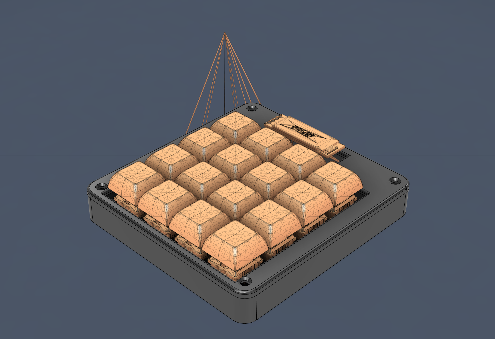
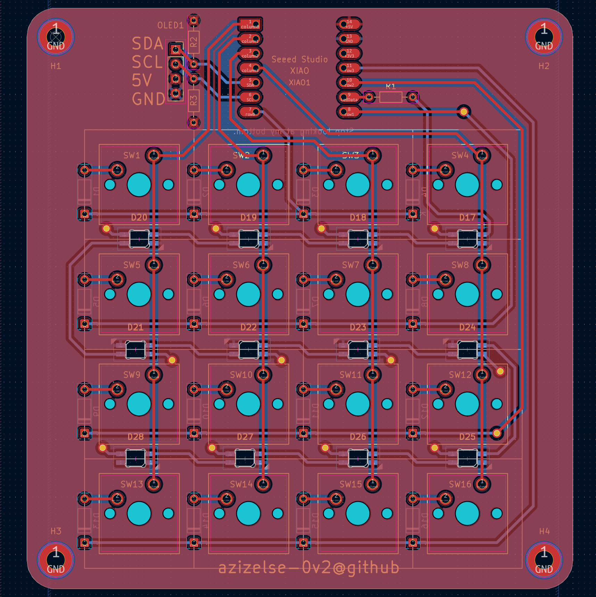
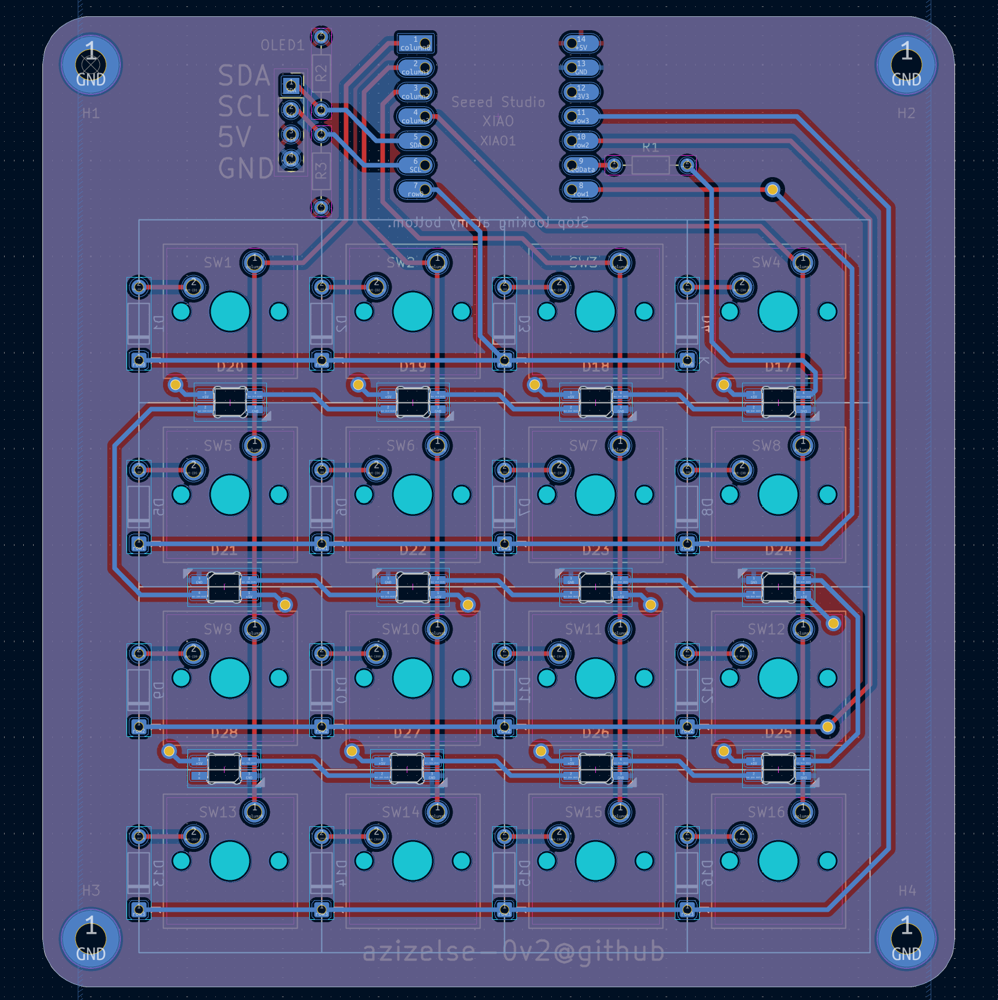
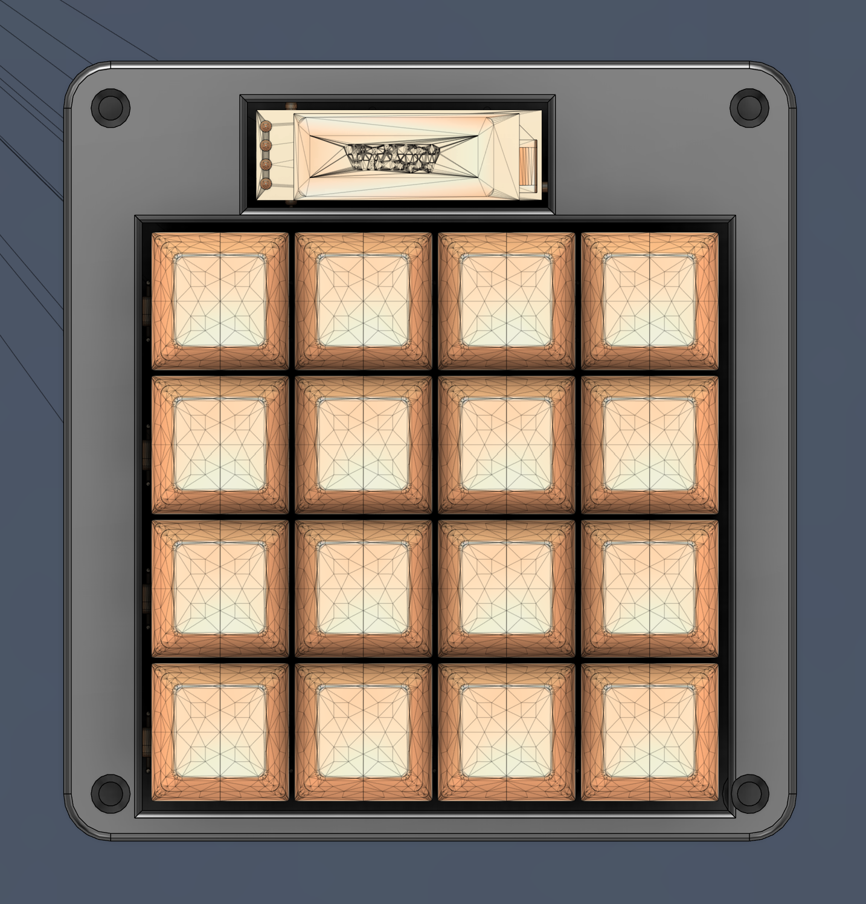

# Macro Pad



A custom macro pad featuring 4 mechanical switches, a rotary encoder, OLED display, and RGB LEDs. Built with the Seeed XIAO RP2040 microcontroller and KMK firmware for a compact, programmable keyboard solution.

## Features

- **4 Cherry MX Switches**: Tactile mechanical switches for responsive key presses
- **Rotary Encoder**: For volume control or custom macros
- **0.96" OLED Display**: SH1106 I2C display for status or custom graphics
- **RGB LED Matrix**: WS2812B LEDs for visual feedback
- **Compact Design**: Fits within 200x200x100mm enclosure
- **KMK Firmware**: Python-based firmware for easy customization

## Images

### Schematic


### PCB Layout


### Case Assembly


## Bill of Materials (BOM)

| Part | Quantity | Description | Supplier |
|------|----------|-------------|----------|
| Seeed XIAO RP2040 | 1 | RP2040 microcontroller board | Seeed Studio |
| Cherry MX Switch | 4 | Mechanical keyboard switches | Cherry |
| DSA Keycap | 4 | Cherry MX compatible keycaps | Keycaps Direct |
| 0.96" OLED Display | 1 | SH1106 128x64 I2C OLED | AliExpress |
| Rotary Encoder | 1 | EC11 rotary encoder | AliExpress |
| WS2812B LED | 4 | RGB LEDs | AliExpress |
| Custom PCB | 1 | 2-layer PCB | This project |
| 3D Printed Case | 1 | ABS/PLA case parts | This project |

## Project Structure

```
macro_pad/
├── CAD/                 # 3D models and assembly
│   ├── macro_pad.step   # Complete assembly model
│   └── Pictures/        # Rendered images
├── PCB/                 # KiCAD design files
│   ├── macro_pad.kicad_pro
│   ├── macro_pad.kicad_sch
│   ├── macro_pad.kicad_pcb
│   └── Pictures/        # PCB images
├── Firmware/            # KMK firmware source
│   ├── main.py
│   └── kmk/             # KMK library
├── Production/          # Manufacturing files
│   ├── gerbers.zip      # PCB gerbers
│   ├── Top.STL          # Case parts
│   ├── Bottom.STL
│   └── firmware.uf2     # Compiled firmware
└── README.md
```

## Building the Macro Pad

### PCB Manufacturing
1. Download `Production/gerbers.zip`
2. Upload to your preferred PCB manufacturer (JLCPCB, PCBWay, etc.)
3. Order 2-layer PCBs with standard specifications

### Case Printing
1. Use the STL files in `Production/` for 3D printing
2. Print with ABS or PLA, 0.2mm layer height recommended
3. Assemble with M2/M3 screws

### Assembly
1. Solder components to the PCB
2. Mount switches and encoder
3. Connect OLED and LEDs
4. Place PCB in case and secure

### Firmware Flashing
1. Install KMK firmware (see Firmware/ directory)
2. Put XIAO RP2040 into bootloader mode (double-click reset)
3. Drag `firmware.uf2` to the RPI-RP2 drive

## Customization

The firmware is written in Python using KMK. Edit `Firmware/main.py` to customize key mappings, LED effects, and display output.

## Repository

- **GitHub**: [azizelse/macro_pad](https://github.com/azizelse/macro_pad)
- **License**: MIT

## Acknowledgments

This project is submitted as part of the Hackpad community challenge. Special thanks to the KMK firmware developers and the open-source hardware community.

---

*Built with ❤️ using KiCAD, Fusion 360, and KMK*